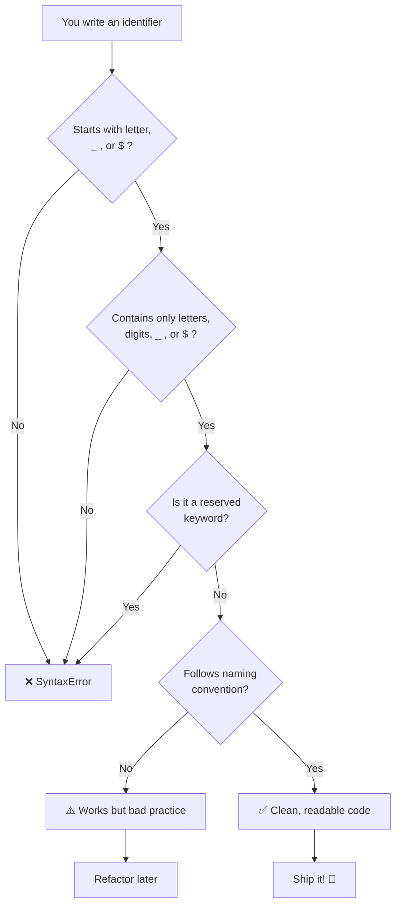

# JavaScript Identifier — Complete Reference

> **Identifier** = Name given to variables, functions, classes, or labels in JavaScript code.

---

## 1. Identifier Rules — Comparison Table

| Rule # | Rule                          | ✅ Valid Example                   | ❌ Invalid Example                        | Reason                                      |
| ------ | ----------------------------- | ---------------------------------- | ----------------------------------------- | ------------------------------------------- |
| 1      | Must start with a **letter**  | `let name = "Shankar";`            | `let 1stPlace = "Gold";`                 | Starts with a number `1`                    |
| 2      | Can start with `_` (underscore) | `let _count = 10;`               | `let _ = 10;` (valid but cryptic)        | Technically valid, but poor practice        |
| 3      | Can start with `$` (dollar)   | `let $price = 99.99;`              | `let $$$ = "cash";` (valid but confusing) | Technically valid, but unreadable           |
| 4      | Can contain **letters, digits, `_`, `$`** | `let user_1$ = "ok";` | `let my-name = "bad";`                   | Hyphen `-` is **not allowed**               |
| 5      | Cannot contain **spaces**     | `let userName = "Shankar";`        | `let my name = "Shankar";`               | Space breaks the syntax                     |
| 6      | Cannot be a **reserved keyword** | `let className = "A";`          | `let class = "A";`                       | `class` is a reserved keyword               |
| 7      | Case-sensitive                | `name ≠ Name`                      | —                                         | `name` and `Name` are **two** identifiers   |
| 8      | Unicode letters allowed       | `let 姓名 = "Chinese";`           | —                                         | JS supports Unicode identifiers             |

---

## 2. Naming Conventions — Comparison Table

| Convention                | Style Pattern           | Example                         | Used For                     |
| ------------------------- | ----------------------- | ------------------------------- | ---------------------------- |
| **camelCase**             | `firstWord lowercase`   | `let userName = "Shankar";`     | ✅ Variables, functions      |
| **PascalCase**            | `EveryWord Capital`     | `class UserProfile {}`          | ✅ Classes, constructors     |
| **snake_case**            | `words_separated_by_underscore` | `let user_profile = "dev";` | ✅ File names, DB columns    |
| **SCREAMING_SNAKE_CASE**  | `ALL_CAPS_UNDERSCORE`   | `const API_KEY = "xyz";`        | ✅ Constants (hard-coded)    |
| **kebab-case**            | `words-separated-by-hyphens` | ❌ Not valid in JS            | ❌ CSS classes, file names   |
| **Hungarian Notation**    | `typePrefix + Name`     | `let strName = "Shankar";`      | ⚠️ Rare in modern JS         |

---

## 3. Identifier Walkthrough — Code + Layer-by-Layer Breakdown

### Full Code Example

```javascript
// ==========================================
// LAYER 1 — Valid Identifiers
// ==========================================
let firstName = "Shankar";       // camelCase → ✅ valid
let $ = "dollar";                // $ only    → ✅ valid (but avoid)
let _ = "underscore";            // _ only    → ✅ valid (but avoid)
let _privateVar = "hidden";      // _ prefix  → ✅ valid (convention for private)
let userName123 = "user";        // letters + digits → ✅ valid

// ==========================================
// LAYER 2 — Invalid Identifiers
// ==========================================
// let 1stName = "Shankar";      // ❌ starts with digit
// let my-name = "Shankar";      // ❌ hyphen not allowed
// let my name = "Shankar";      // ❌ space not allowed
// let class = "math";           // ❌ reserved keyword

// ==========================================
// LAYER 3 — Case Sensitivity
// ==========================================
let city = "Hyderabad";
let City = "Bangalore";          // Different identifier!
console.log(city);               // → "Hyderabad"
console.log(City);               // → "Bangalore"

// ==========================================
// LAYER 4 — Naming Conventions in Action
// ==========================================
const MAX_RETRIES = 3;           // SCREAMING_SNAKE_CASE → constant
let userRole = "admin";          // camelCase → variable
class ShoppingCart {}            // PascalCase → class
```

### Layer-by-Layer Breakdown

| Layer | Concept              | Code Snippet                         | What Happens                        |
| ----- | -------------------- | ------------------------------------ | ----------------------------------- |
| 1     | ✅ Valid identifiers | `let firstName = "Shankar";`         | Compiles & runs without error       |
| 2     | ❌ Invalid identifiers | `let 1stName` / `let my-name`     | `SyntaxError` — JS parser rejects   |
| 3     | 🔤 Case sensitivity  | `city` vs `City`                     | Two separate memory locations       |
| 4     | 🏷️ Naming convention | `MAX_RETRIES` / `userRole`           | Improves readability & intent       |

---

## 4. Identifier Resolution Pipeline — Flow Diagram



---

## 5. Quick Reference — Identifier Character Map

```
Allowed first character :  letter (a-z, A-Z)  |  _ (underscore)  |  $ (dollar)
Allowed body characters :  letters  |  digits  |  _  |  $
Forbidden characters    :  spaces  |  hyphens  |  @  |  #  |  !  |  %  |  &
Reserved keywords       :  class  |  const  |  let  |  var  |  function  |  if  |  else  |  for  |  while  |  return  |  etc.
```

---

## 6. TL;DR

| # | Rule                          | One-liner                                         |
| - | ----------------------------- | ------------------------------------------------- |
| 1 | **Start character**           | Must be `letter`, `_`, or `$` — **never** a digit |
| 2 | **Body characters**           | Only `letters`, `digits`, `_`, `$` — no spaces    |
| 3 | **Reserved keywords**         | Cannot use `class`, `let`, `const`, `function`…   |
| 4 | **Case sensitivity**          | `user` and `User` are **different** identifiers   |
| 5 | **Best practice**             | Use **camelCase** for variables & functions       |
| 6 | **Constants**                 | Use **SCREAMING_SNAKE_CASE**                      |
| 7 | **Classes**                   | Use **PascalCase**                                |
| 8 | **Special characters**        | Only `_` and `$` are allowed — no `-`, `@`, `#`   |

> 💡 **Golden Rule:** If your identifier starts with a letter and contains only letters, digits, `_`, and `$` — and is **not** a reserved keyword — it's a valid JavaScript identifier. Stick to **camelCase** and your code will be clean and professional.