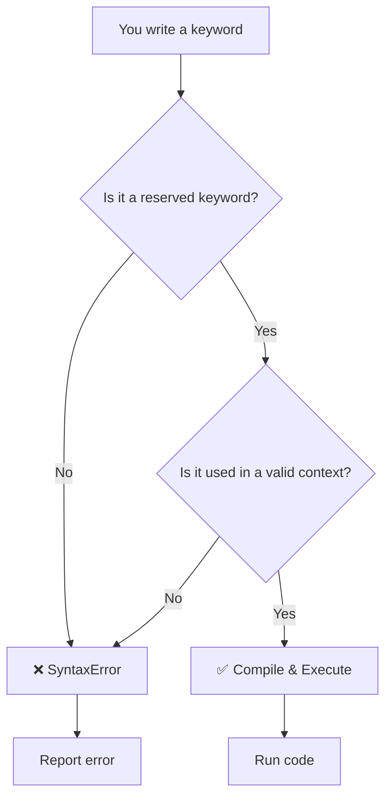

# JavaScript Keywords — Complete Reference

> **Keyword** = Reserved word in JavaScript that has special meaning.

---

## 1. Keyword Comparison Table

| Keyword | Reserved? | Typical Use | Example |
|---|---|---|---|
| `function` | ✅ | Declare a function | `function add(a,b){ return a+b; }` |
| `var` | ✅ | Variable declaration (function‑scoped) | `var count = 0;` |
| `let` | ✅ | Variable declaration (block‑scoped) | `let count = 0;` |
| `const` | ✅ | Constant declaration (block‑scoped) | `const PI = 3.14;` |
| `if` | ✅ | Conditional statement | `if (x > 0) { ... }` |
| `else` | ✅ | Alternative branch | `else { ... }` |
| `for` | ✅ | Loop | `for (let i=0; i<10; i++) { ... }` |
| `while` | ✅ | Loop | `while (condition) { ... }` |
| `return` | ✅ | Return from function | `return value;` |
| `break` | ✅ | Exit loop/switch | `break;` |
| `continue` | ✅ | Skip to next iteration | `continue;` |
| `switch` | ✅ | Switch statement | `switch (x) { ... }` |
| `case` | ✅ | Switch case label | `case 1: ...` |
| `default` | ✅ | Switch default branch | `default: ...` |
| `try` | ✅ | Exception handling | `try { ... }` |
| `catch` | ✅ | Exception handler | `catch (e) { ... }` |
| `finally` | ✅ | Final cleanup | `finally { ... }` |
| `throw` | ✅ | Throw error | `throw new Error('msg');` |
| `new` | ✅ | Create instance | `let obj = new Object();` |
| `this` | ✅ | Current execution context | `function foo(){ console.log(this); }` |
| `import` | ✅ | ES module import | `import { x } from './mod';` |
| `export` | ✅ | ES module export | `export const y = 10;` |
| `class` | ✅ | Class definition | `class MyClass {};` |
| `extends` | ✅ | Inheritance | `class Sub extends Super {}` |
| `await` | ✅ | Wait for promise | `await promise;` |
| `yield` | ✅ | Generator pause | `function* gen(){ yield 1; }` |
| `enum` | ✅ | (ES2023) enum syntax | `enum Direction { Up = 1 };` |

---

## 2. Keyword Walkthrough — Code + Layer‑by‑Layer Breakdown

### Full Code Example

```javascript
// Layer 1 — Function Declaration
function add(a, b) { // `function` keyword
    // Layer 2 — Conditional
    if (a > b) { // `if` keyword
        return a; // `return` keyword
    } else { // `else` keyword
        return b; // `return` keyword
    }
}

// Layer 3 — Loop
for (let i = 0; i < 5; i++) { // `for` and `let` keywords
    console.log(i);
}

// Layer 4 — Exception Handling
try { // `try` keyword
    const result = add(2, 3);
    console.log(result);
} catch (err) { // `catch` keyword
    console.error(err);
} finally { // `finally` keyword
    // cleanup code
}
```

### Layer‑by‑Layer Breakdown

| Layer | Concept | Code Snippet | What Happens |
| ----- | ------- | ------------ | ------------ |
| 1 | **Function Declaration** | `function add(a, b) {` | `function` tells JS to create a callable function. |
| 2 | **Conditional** | `if (a > b) {` | `if` evaluates the expression; if true, executes the block. |
| 3 | **Loop** | `for (let i = 0; i < 5; i++) {` | `for` creates a loop; `let` declares the counter. |
| 4 | **Exception Handling** | `try { ... } catch (err) { ... } finally { ... }` | `try` begins a protected block; `catch` handles errors; `finally` runs cleanup. |

---

## 3. Keyword Resolution Pipeline — Flow Diagram



---

## 4. TL;DR

- **Keywords are reserved** – they cannot be used as variable/function/class names.  
- **Common groups**: declaration (`var`, `let`, `const`, `function`, `class`), control (`if`, `else`, `for`, `while`, `switch`, `case`, `default`), loops (`break`, `continue`), error handling (`try`, `catch`, `finally`, `throw`), modules (`import`, `export`), OOP (`this`, `new`, `super`), generators (`yield`), etc.  
- **Case‑sensitive** – `Function` is a valid identifier, but `function` is a keyword.  
- **Never re‑declare** a keyword as a variable – it will cause a syntax error.  
- **Use them correctly** – they control flow, define scope, and create objects; misuse leads to bugs.  
- **Remember**: `await` only works inside `async` functions; `yield` creates generators.  

> 💡 **Golden Rule:** If a word is highlighted in **purple** by your editor (or listed in the ECMAScript spec), it’s a keyword – treat it as a special token, not a name you can reuse.