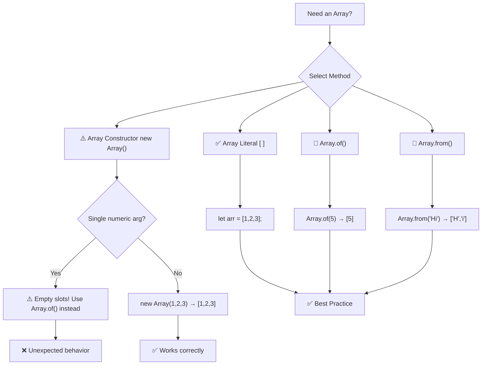
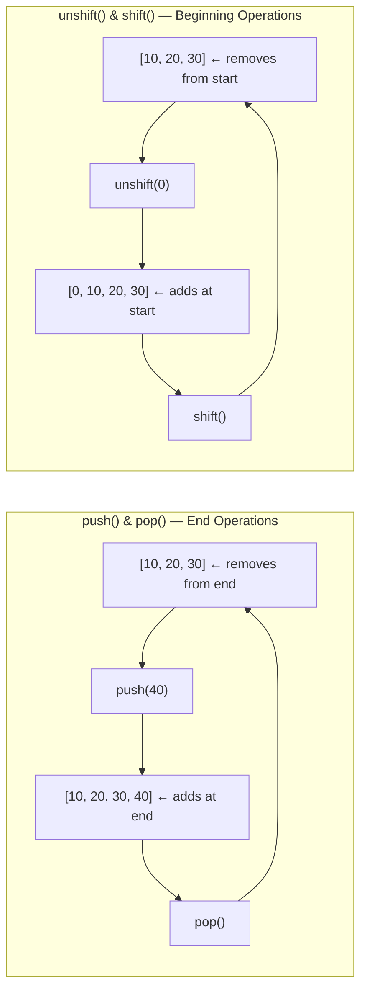
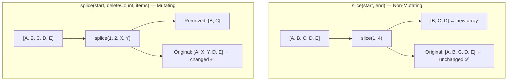
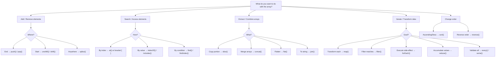

# JavaScript Arrays — Complete Master Guide

> **Array** = An ordered, zero-indexed collection of values stored in a single variable. In JavaScript, arrays are special objects that can hold values of **any type**, grow or shrink **dynamically**, and are commonly traversed using loops or built-in array methods.

---

## 1. What is an Array?

An array is a **data structure** that allows you to store multiple values under a single name, organized by numeric indices.

### Key Characteristics

| Feature | Description |
|---------|-------------|
| **Ordered** | Elements maintain the order in which they are inserted |
| **Zero-indexed** | First element is at index `0`, second at `1`, etc. |
| **Dynamic** | Arrays grow/shrink automatically — no fixed size |
| **Heterogeneous** | Can hold values of **any type** in the same array: numbers, strings, booleans, objects, even other arrays |
| **Reference type** | Stored in heap memory; variables hold a reference (pointer) to the array |
| **`typeof`** | Returns `"object"` — use `Array.isArray()` to check if a value is an array |

```javascript
// Arrays can hold mixed types
let mixed = [1, "hello", true, null, { name: "Shankar" }, [10, 20]];
console.log(typeof mixed);      // "object"
console.log(Array.isArray(mixed)); // true
```

---

## 2. Array Declaration & Initialization — Comparison Table

| Method | Syntax | Example | When to Use |
|--------|--------|---------|-------------|
| **Array Literal** ✅ *(Recommended)* | `let arr = [v1, v2, ...];` | `let fruits = ["Apple", "Banana"];` | **Preferred** — simplest, fastest, most readable |
| **Array Constructor** | `let arr = new Array(v1, v2, ...);` | `let nums = new Array(1, 2, 3);` | Rarely — only when dynamic arguments needed |
| **Array Constructor (single number)** ⚠️ | `let arr = new Array(n);` | `let arr = new Array(5);` | Creates **empty slots** — **not** filled with `undefined` |
| **`Array.of()`** | `let arr = Array.of(v1, v2, ...);` | `let arr = Array.of(10, 20, 30);` | Safe alternative to constructor — no single-number trap |
| **`Array.from()`** | `let arr = Array.from(iterable);` | `let chars = Array.from("Hello");` | Convert iterables (strings, Sets, Maps) to arrays |

### Code Example — All Declaration Methods

```javascript
// ==========================================
// METHOD 1: Array Literal (✅ Preferred)
// ==========================================
let fruits = ["Apple", "Banana", "Mango", "Orange"];
let empty = [];                         // Empty array
let mixed = [1, "hello", true, null];   // Mixed types

// ==========================================
// METHOD 2: Array Constructor
// ==========================================
let scores = new Array(1, 2, 3);        // → [1, 2, 3]
let scores2 = new Array(3);             // ⚠️ [empty × 3] — 3 empty slots!
let scores3 = new Array(3, 4);          // → [3, 4] (two+ args = normal)

// ==========================================
// METHOD 3: Array.of() — Safe constructor
// ==========================================
let test = Array.of(10, 20, 30, 40, 50); // → [10, 20, 30, 40, 50]
let test2 = Array.of(3);                 // → [3] (single element, NOT empty slots)

// ==========================================
// METHOD 4: Array.from() — From iterables
// ==========================================
let chars = Array.from("Hello");         // → ["H", "e", "l", "l", "o"]
let fromSet = Array.from(new Set([1,2,3])); // → [1, 2, 3]
```

### The `new Array(5)` Trap ⚠️

```javascript
let a = new Array(5);    // → [empty × 5] — empty slots, NOT undefined!
let b = [undefined, undefined, undefined, undefined, undefined]; // Actual undefined values

console.log(a.length);   // 5
console.log(b.length);   // 5

// Empty slots behave differently with array methods
console.log(a.map(x => 1)); // → [empty × 5]  — map skips empty slots!
console.log(b.map(x => 1)); // → [1, 1, 1, 1, 1]
```

---

## 3. Best Practices for Creating Arrays

| Practice | ✅ Do This | ❌ Avoid This | Reason |
|----------|-----------|---------------|--------|
| **Use array literals** | `let arr = [1, 2, 3];` | `let arr = new Array(1, 2, 3);` | Literals are faster, safer, and more readable |
| **Avoid single-number constructor** | `Array.of(5)` or `[5]` | `new Array(5)` | Creates empty slots, not an array with value `5` |
| **Initialize with values** | `let arr = [0, 0, 0];` | `let arr = []; arr.length = 3;` | Predictable state from the start |
| **Use `const` for reference** | `const arr = [1, 2, 3];` | `let arr = [1, 2, 3];` | `const` prevents reassignment (content can still change) |
| **Use `Array.isArray()`** | `Array.isArray(value)` | `typeof value === "object"` | `typeof` can't distinguish arrays from objects |
| **Prefer `Array.from()` for conversions** | `Array.from(nodeList)` | `Array.prototype.slice.call(nodeList)` | Cleaner, more modern syntax |

### Declaration & Initialization — Visual Pipeline



---

## 4. Retrieving Array Elements

### 4.1 Forward Direction (Positive Index)

Forward indexing starts at `0` and goes up to `length - 1`.

```javascript
let browsers = ["Chrome", "Firefox", "Safari", "Opera", "Edge"];

console.log(browsers[0]);  // "Chrome"   — first element
console.log(browsers[1]);  // "Firefox"  — second element
console.log(browsers[4]);  // "Edge"     — last element (length - 1)
console.log(browsers[5]);  // undefined  — out of bounds (no error)
```

### 4.2 Backward Direction (Negative Index)

JavaScript does **not** natively support negative indexing with bracket notation. Use the `at()` method or compute the index manually.

| Approach | Syntax | Example | Result |
|----------|--------|---------|--------|
| **`at()` method** ✅ | `arr.at(-1)` | `browsers.at(-1)` | `"Edge"` — last element |
| **Manual calculation** | `arr[arr.length - 1]` | `browsers[browsers.length - 1]` | `"Edge"` |
| **Bracket `[-1]`** ❌ | `arr[-1]` | `browsers[-1]` | `undefined` (treated as property, not index) |

```javascript
let browsers = ["Chrome", "Firefox", "Safari", "Opera", "Edge"];

// ❌ Bracket notation with negative index — does NOT work
console.log(browsers[-1]);  // undefined

// ✅ Using at() method — clean & modern
console.log(browsers.at(-1));  // "Edge"
console.log(browsers.at(-2));  // "Opera"
console.log(browsers.at(-5));  // "Chrome"
console.log(browsers.at(-9));  // undefined — out of bounds

// ✅ Manual calculation — traditional approach
console.log(browsers[browsers.length - 1]);  // "Edge"
console.log(browsers[browsers.length - 2]);  // "Opera"
```

### Array Indexing — Visual Diagram

```
      Forward (Positive) Indexing
   ┌──────┬──────┬──────┬──────┬──────┐
   │   0  │   1  │   2  │   3  │   4  │
   ├──────┼──────┼──────┼──────┼──────┤
   │Chrome│Firefx│Safari│Opera │ Edge │
   ├──────┼──────┼──────┼──────┼──────┤
   │  -5  │  -4  │  -3  │  -2  │  -1  │
   └──────┴──────┴──────┴──────┴──────┘
      Backward (Negative) Indexing [via at()]
```

---

## 5. Array Functions — Complete Reference

### Phase 1: Adding & Removing Elements

These methods **mutate** (modify) the original array.

| Method | Action | Returns | Mutates? | Syntax |
|--------|--------|---------|----------|--------|
| **`push()`** | Add element(s) to **end** | New length of array | ✅ Yes | `arr.push(4)` or `arr.push(4,5,6)` |
| **`pop()`** | Remove **last** element | Removed element | ✅ Yes | `let el = arr.pop()` |
| **`unshift()`** | Add element(s) to **beginning** | New length of array | ✅ Yes | `arr.unshift(0)` or `arr.unshift(-1,0)` |
| **`shift()`** | Remove **first** element | Removed element | ✅ Yes | `let el = arr.shift()` |

#### Code Walkthrough — Phase 1

```javascript
let arr = [99, 10, 102, 67, 13, 22];
console.log("Original:", arr);  // [99, 10, 102, 67, 13, 22]

// ---------- push() — Add to end ----------
let newLen = arr.push(98);
console.log("After push(98):", arr);       // [99, 10, 102, 67, 13, 22, 98]
console.log("New length:", newLen);        // 7

arr.push(1, 2);                            // Can push multiple
console.log("After push(1,2):", arr);      // [99, 10, 102, 67, 13, 22, 98, 1, 2]

// ---------- pop() — Remove from end ----------
let removed = arr.pop();
console.log("Removed:", removed);           // 2
console.log("After pop():", arr);           // [99, 10, 102, 67, 13, 22, 98, 1]

// ---------- unshift() — Add to beginning ----------
let newLen2 = arr.unshift(100);
console.log("After unshift(100):", arr);    // [100, 99, 10, 102, 67, 13, 22, 98, 1]
console.log("New length:", newLen2);        // 9

arr.unshift(200, 300);                      // Can unshift multiple
console.log("After unshift(200,300):", arr);// [200, 300, 100, 99, 10, 102, 67, 13, 22, 98, 1]

// ---------- shift() — Remove from beginning ----------
let first = arr.shift();
console.log("Removed first:", first);        // 200
console.log("After shift():", arr);          // [300, 100, 99, 10, 102, 67, 13, 22, 98, 1]
```

#### Visual: push / pop / unshift / shift



---

### Phase 2: Searching & Accessing Elements

| Method | Action | Returns | Mutates? | Syntax |
|--------|--------|---------|----------|--------|
| **`at()`** | Access element at index (supports negative) | Element or `undefined` | ❌ No | `arr.at(-1)` |
| **`indexOf()`** | First index of a value | Index or `-1` | ❌ No | `arr.indexOf(10)` |
| **`lastIndexOf()`** | Last index of a value | Index or `-1` | ❌ No | `arr.lastIndexOf(10)` |
| **`includes()`** | Check if value exists | `boolean` | ❌ No | `arr.includes(10)` |
| **`find()`** | First element passing a test | Element or `undefined` | ❌ No | `arr.find(x => x > 20)` |
| **`findIndex()`** | Index of first element passing test | Index or `-1` | ❌ No | `arr.findIndex(x => x > 20)` |
| **`findLast()`** | Last element passing a test (ES2023) | Element or `undefined` | ❌ No | `arr.findLast(x => x > 20)` |
| **`findLastIndex()`** | Index of last element passing test (ES2023) | Index or `-1` | ❌ No | `arr.findLastIndex(x => x > 20)` |

#### Code Walkthrough — Phase 2

```javascript
let arr = [99, 10, 102, 67, 13, 22, 99];

// ---------- at() — Access with positive/negative index ----------
console.log(arr.at(0));    // 99   — first element
console.log(arr.at(2));    // 102  — third element
console.log(arr.at(-1));   // 99   — last element (backward direction)
console.log(arr.at(-3));   // 13   — third from end
console.log(arr.at(20));   // undefined — out of bounds (no error)

// ---------- indexOf() — First occurrence ----------
console.log(arr.indexOf(99));   // 0   — first 99 at index 0
console.log(arr.indexOf(13));   // 4   — 13 at index 4
console.log(arr.indexOf(999));  // -1  — not found

// ---------- lastIndexOf() — Last occurrence ----------
console.log(arr.lastIndexOf(99));  // 6  — last 99 at index 6

// ---------- includes() — Boolean check ----------
console.log(arr.includes(102));  // true
console.log(arr.includes(1));    // false
console.log(arr.includes(67, 5));// false — starts search from index 5

// ---------- find() — First match ----------
let firstOver20 = arr.find(n => n > 20);
console.log(firstOver20);        // 99 — first element > 20

// ---------- findIndex() — Index of first match ----------
let idx = arr.findIndex(n => n > 20);
console.log(idx);                // 0 — index of first element > 20

// ---------- findLast() — Last match (ES2023) ----------
let lastOver20 = arr.findLast(n => n > 20);
console.log(lastOver20);         // 99 — last element > 20

// ---------- findLastIndex() — Index of last match (ES2023) ----------
let lastIdx = arr.findLastIndex(n => n > 20);
console.log(lastIdx);            // 6 — index of last element > 20
```

---

### Phase 3: Extracting, Slicing & Combining

| Method | Action | Returns | Mutates? | Syntax |
|--------|--------|---------|----------|--------|
| **`slice()`** | Extract a **shallow copy** of a portion | New array | ❌ No | `arr.slice(0, 3)` |
| **`splice()`** | Add / Remove / Replace elements **in-place** | Array of removed elements | ✅ Yes | `arr.splice(1, 2, 10, 20)` |
| **`concat()`** | Merge two or more arrays | New array | ❌ No | `arr1.concat(arr2, arr3)` |

#### `slice()` — Detailed Rules

| Rule | Description |
|------|-------------|
| **Original unchanged** | ✅ `slice()` never modifies the original array |
| **`start` is inclusive** | The element at `start` index is included |
| **`end` is exclusive** | The element at `end` index is **not** included |
| **Negative indexes** | Count from the end of the array |
| **`end` omitted / `undefined`** | Copies until the end of the array |
| **Direction** | Always traverses **left to right** |
| **Empty result** | If `start >= end`, result is `[]` |
| **Shallow copy** | Nested objects are copied by reference, not deep-cloned |

#### `splice()` — Operation Modes

| Mode | Syntax | What It Does |
|------|--------|--------------|
| **Remove only** | `arr.splice(start, deleteCount)` | Removes `deleteCount` elements starting at `start` |
| **Add only** | `arr.splice(start, 0, item1, item2)` | Inserts items at `start` — removes 0 |
| **Replace** | `arr.splice(start, deleteCount, item1, item2)` | Removes `deleteCount` elements, then inserts new items |

#### Code Walkthrough — Phase 3

```javascript
let arr = [99, 10, 102, 67, 13, 22];

// ---------- slice() — Extract portion ----------
let copy1 = arr.slice(0, 3);         // Indices 0,1,2 → [99, 10, 102]
console.log(copy1);
console.log("Original unchanged?", arr);  // ✅ Yes — [99, 10, 102, 67, 13, 22]

let copy2 = arr.slice(2);            // Index 2 to end → [102, 67, 13, 22]
let copy3 = arr.slice(-3, -1);       // Negative indices → [67, 13]
let copy4 = arr.slice(-1);           // Last element → [22]
let copy5 = arr.slice(3, 1);         // start > end → []

// ---------- splice() — Remove, Add, Replace ----------
let arr2 = [99, 10, 102, 67, 13, 22];

// Remove: start=1, deleteCount=1
let removed = arr2.splice(1, 1);
console.log("Removed:", removed);     // [10]
console.log("After remove:", arr2);   // [99, 102, 67, 13, 22]

// Add: start=1, deleteCount=0 → insert 10, 20
arr2.splice(1, 0, 10, 20);
console.log("After add:", arr2);      // [99, 10, 20, 102, 67, 13, 22]

// Replace: start=1, deleteCount=2 → remove 10,20 and add 100,200
arr2.splice(1, 2, 100, 200);
console.log("After replace:", arr2);  // [99, 100, 200, 102, 67, 13, 22]

// ---------- concat() — Merge arrays ----------
let arr1 = [99, 10, 102, 67, 13, 22];
let arrB = [20, 30, 98];

let combined = arr1.concat(arrB);
console.log(combined);                // [99, 10, 102, 67, 13, 22, 20, 30, 98]

// Can concat multiple arrays + values
let combined2 = arr1.concat(arrB, [77, 55], 100);
console.log(combined2);               // [99, 10, 102, 67, 13, 22, 20, 30, 98, 77, 55, 100]
```

#### Visual: slice() vs splice()



---

### Phase 4: Iteration & Transformation

These methods are used for **looping through** and **transforming** array data.

| Method | Action | Returns | Mutates? | Use Case |
|--------|--------|---------|----------|----------|
| **`forEach()`** | Execute a function for each element | `undefined` | ❌ No | Side effects (logging, DOM updates) |
| **`map()`** | Transform each element | New array (same length) | ❌ No | Data transformation |
| **`filter()`** | Keep elements that pass a test | New array (may be shorter) | ❌ No | Filtering data |
| **`reduce()`** | Accumulate values into a single result | Any type (number, string, object) | ❌ No | Summation, aggregation |
| **`every()`** | Check if **all** elements pass a test | `boolean` | ❌ No | Validation |
| **`some()`** | Check if **any** element passes a test | `boolean` | ❌ No | Validation |
| **`sort()`** | Sort elements **in-place** | Sorted array (same reference) | ✅ Yes | Ordering |
| **`reverse()`** | Reverse elements **in-place** | Reversed array | ✅ Yes | Reversing |
| **`flat()`** | Flatten nested arrays | New array | ❌ No | Flattening |
| **`join()`** | Join elements into a string | `string` | ❌ No | Creating CSV / display strings |

#### Code Walkthrough — Phase 4

```javascript
let tests = ["login", "dashboard", "checkout", "search", "payment"];
let numbers = [10, 99, 12, 88, 45];
let students = ["Deepak", "Pramod", "Sahil", "Himanshu", "Daveed"];

// ========== forEach() — Execute for each element ==========
console.log("=== forEach ===");
tests.forEach((test, index) => {
    console.log(`${index}: ${test}`);
});
// Output:
// 0: login
// 1: dashboard
// 2: checkout
// 3: search
// 4: payment

// ========== map() — Transform each element ==========
let upperCase = tests.map(t => t.toUpperCase());
console.log("map():", upperCase);  
// ["LOGIN", "DASHBOARD", "CHECKOUT", "SEARCH", "PAYMENT"]

// Real-time: Append environment prefix to test names
let testCases = tests.map(t => `https://app.com/${t}`);
console.log("Test URLs:", testCases);
// ["https://app.com/login", "https://app.com/dashboard", ...]

// ========== filter() — Keep matching elements ==========
let over50 = numbers.filter(n => n > 50);
console.log("filter() > 50:", over50);  // [99, 88]

// Real-time: Filter passed tests
let results = ["pass", "fail", "pass", "skip", "pass"];
let passed = results.filter(r => r === "pass");
console.log("Passed count:", passed.length);  // 3

// ========== reduce() — Accumulate ==========
let sum = numbers.reduce((acc, curr) => acc + curr, 0);
console.log("reduce() sum:", sum);  // 254

// Real-time: Total test execution time
let durations = [120, 85, 200, 95, 150];
let totalTime = durations.reduce((acc, d) => acc + d, 0);
console.log("Total test time:", totalTime, "ms");  // 650ms

// ========== every() & some() — Validation ==========
let allPassed = results.every(r => r === "pass");
console.log("All passed?", allPassed);  // false

let anyFailed = results.some(r => r === "fail");
console.log("Any failed?", anyFailed);  // true

// ========== sort() — Sorting ==========
let unsorted = [99, 10, 102, 67, 13, 22];
unsorted.sort((a, b) => a - b);       // Numeric ascending
console.log("sort() ascending:", unsorted);  // [10, 13, 22, 67, 99, 102]

unsorted.sort((a, b) => b - a);       // Numeric descending
console.log("sort() descending:", unsorted); // [102, 99, 67, 22, 13, 10]

// ⚠️ Default sort converts to strings!
console.log([99, 10, 102].sort());    // [10, 102, 99] — string sort!

// ========== reverse() — Reversing ==========
let rev = [1, 2, 3, 4, 5];
rev.reverse();
console.log("reverse():", rev);       // [5, 4, 3, 2, 1]

// ========== flat() — Flatten nested arrays ==========
let nested = [1, [2, 3], [4, [5, 6]]];
console.log("flat():", nested.flat());        // [1, 2, 3, 4, [5, 6]]
console.log("flat(2):", nested.flat(2));      // [1, 2, 3, 4, 5, 6]

// ========== join() — Array to string ==========
let csv = tests.join(",");
console.log("join():", csv);  // "login,dashboard,checkout,search,payment"

let sentence = tests.join(" → ");
console.log("join with arrow:", sentence);  // "login → dashboard → checkout → search → payment"
```

---

### Phase 5: `for...of` & `for...in` — Loop Syntax Comparison

| Loop Type | Iterates Over | Use Case | Example |
|-----------|---------------|----------|---------|
| **`for...of`** | **Values** of iterable | Getting array elements directly | `for (let val of arr)` |
| **`for...in`** | **Keys / indices** (strings) | Objects or debugging indexes | `for (let idx in arr)` |
| **Traditional `for`** | Index counter | Full control of iteration | `for (let i = 0; i < arr.length; i++)` |

```javascript
let browsers = ["Chrome", "Firefox", "Safari", "Edge"];

// Traditional for loop — full control
for (let i = 0; i < browsers.length; i++) {
    console.log(browsers[i]);
}

// for...of — cleanest for values
for (let browser of browsers) {
    console.log(browser);
}

// forEach — functional style
browsers.forEach((b, i) => console.log(`${i}: ${b}`));

// for...in — gives indices (not recommended for arrays)
for (let idx in browsers) {
    console.log(idx, "→", browsers[idx]);
}
```

---

## 6. Real-World Examples

### 6.1 Browser Automation — Test Framework

```javascript
// Real-time: Managing browser instances in automation
let browsers = ["Chrome", "Firefox", "Safari", "Opera", "Edge"];

console.log("Available browsers:", browsers);

// Pop the last browser (Edge) — maybe it's not installed
let removed = browsers.pop();
console.log("Removed:", removed);        // "Edge"
console.log("Active browsers:", browsers);

// Shift the first browser — run Chrome first
let first = browsers.shift();
console.log("Running first:", first);    // "Chrome"
console.log("Remaining:", browsers);

// Iterate and check compatibility
for (let i = 0; i < browsers.length; i++) {
    console.log(`Launching ${browsers[i]}...`);
    if (browsers[i] === "Opera") {
        console.log("⚠️ Opera doesn't support Automation now!");
    }
}
```

### 6.2 Test Results Dashboard

```javascript
let testResults = [
    { name: "Login Test", status: "pass", duration: 120 },
    { name: "Dashboard Test", status: "pass", duration: 85 },
    { name: "Payment Test", status: "fail", duration: 200 },
    { name: "Search Test", status: "skip", duration: 0 },
    { name: "Logout Test", status: "pass", duration: 95 },
];

// Get all passed tests
let passedTests = testResults.filter(t => t.status === "pass");
console.log("Passed tests:", passedTests.length);

// Get names of failed tests
let failedNames = testResults
    .filter(t => t.status === "fail")
    .map(t => t.name);
console.log("Failed:", failedNames);  // ["Payment Test"]

// Total execution time
let totalTime = testResults.reduce((acc, t) => acc + t.duration, 0);
console.log("Total duration:", totalTime, "ms");

// Check if all tests passed
let allPassed = testResults.every(t => t.status === "pass");
console.log("Release ready?", allPassed ? "✅ Yes" : "❌ No");
```

### 6.3 Configuration Manager

```javascript
// Real-time: Managing environment configurations
const DEFAULT_CONFIGS = {
    browsers: ["Chrome", "Firefox"],
    timeout: 30000,
    headless: true,
};

let userConfigs = ["Edge", "Safari"];

// Combine default + user browsers using concat
let allBrowsers = DEFAULT_CONFIGS.browsers.concat(userConfigs);
console.log("All browsers:", allBrowsers);  
// ["Chrome", "Firefox", "Edge", "Safari"]

// Remove duplicates
let uniqueBrowsers = [...new Set(allBrowsers)];

// Check if a specific browser is in the list
let hasChrome = allBrowsers.includes("Chrome");
console.log("Chrome available?", hasChrome);  // true
```

### 6.4 API Response Data Processing

```javascript
// Real-time: Processing API response data
let apiResponse = {
    status: 200,
    data: [
        { id: 1, title: "Test Case 1", priority: "P0" },
        { id: 2, title: "Test Case 2", priority: "P1" },
        { id: 3, title: "Test Case 3", priority: "P0" },
        { id: 4, title: "Test Case 4", priority: "P2" },
    ],
};

// Extract all P0 test cases
let criticalTests = apiResponse.data.filter(t => t.priority === "P0");
console.log("Critical tests:", criticalTests);

// Extract just the IDs of P1 tests
let p1Ids = apiResponse.data
    .filter(t => t.priority === "P1")
    .map(t => t.id);
console.log("P1 test IDs:", p1Ids);  // [2]
```

---

## 7. Complete Array Methods — Quick Reference Table

| Category | Method | Mutates? | Returns | Use Case |
|----------|--------|----------|---------|----------|
| **Add/Remove** | `push()` | ✅ | New length | Add to end |
| | `pop()` | ✅ | Removed element | Remove from end |
| | `unshift()` | ✅ | New length | Add to start |
| | `shift()` | ✅ | Removed element | Remove from start |
| | `splice()` | ✅ | Removed elements | Add / Remove / Replace anywhere |
| **Access/Search** | `at()` | ❌ | Element or `undefined` | Access with negative index |
| | `indexOf()` | ❌ | Index or `-1` | Find first occurrence |
| | `lastIndexOf()` | ❌ | Index or `-1` | Find last occurrence |
| | `includes()` | ❌ | `boolean` | Check existence |
| | `find()` | ❌ | Element or `undefined` | Find by condition |
| | `findIndex()` | ❌ | Index or `-1` | Find index by condition |
| | `findLast()` | ❌ | Element or `undefined` | Find last by condition |
| | `findLastIndex()` | ❌ | Index or `-1` | Find last index by condition |
| **Extract/Combine** | `slice()` | ❌ | New array | Copy portion |
| | `concat()` | ❌ | New array | Merge arrays |
| | `flat()` | ❌ | New array | Flatten nested |
| | `join()` | ❌ | `string` | Array → string |
| **Iterate/Transform** | `forEach()` | ❌ | `undefined` | Execute per element |
| | `map()` | ❌ | New array | Transform each element |
| | `filter()` | ❌ | New array | Keep matches |
| | `reduce()` | ❌ | Single value | Accumulate |
| | `every()` | ❌ | `boolean` | All match? |
| | `some()` | ❌ | `boolean` | Any match? |
| **Order** | `sort()` | ✅ | Same array | Sort in-place |
| | `reverse()` | ✅ | Same array | Reverse in-place |

---

## 8. Array Decision Flowchart



---

## 9. TL;DR — Quick Summary

| Topic | One-liner |
|-------|-----------|
| **What is an Array?** | Ordered, zero-indexed, dynamic collection of values — a special object in JS |
| **Declaration** | Use **array literals** `[ ]` — avoid `new Array(n)` with single number |
| **Best Practice** | `const arr = [1, 2, 3]` — literal syntax with `const` |
| **Forward index** | `arr[0]` — starts at `0`, ends at `arr.length - 1` |
| **Backward index** | Use `arr.at(-1)` — bracket notation `[-1]` returns `undefined` |
| **Add to end** | `arr.push(value)` — returns new length |
| **Remove from end** | `arr.pop()` — returns removed element |
| **Add to start** | `arr.unshift(value)` — returns new length |
| **Remove from start** | `arr.shift()` — returns removed element |
| **Copy portion** | `arr.slice(start, end)` — non-mutating, `end` is exclusive |
| **Add/Remove anywhere** | `arr.splice(start, deleteCount, items)` — mutates original |
| **Merge arrays** | `arr1.concat(arr2)` — non-mutating |
| **Find element** | `arr.find(x => x > 10)` — returns first match or `undefined` |
| **Transform** | `arr.map(x => x * 2)` — returns new array |
| **Filter** | `arr.filter(x => x > 10)` — returns new array |
| **Accumulate** | `arr.reduce((acc, x) => acc + x, 0)` — returns single value |
| **Check all/any** | `arr.every(fn)` / `arr.some(fn)` — returns `boolean` |
| **Sort** | `arr.sort((a,b) => a - b)` — ascending numeric; **default is string sort!** |
| **Check if array** | `Array.isArray(value)` — not `typeof` (returns `"object"`) |

> 💡 **Golden Rule:** Arrays in JavaScript are versatile, dynamic, and packed with built-in methods. Master the mutating vs non-mutating distinction — use `push/pop/shift/unshift/splice` when you want to **change** the original, and `map/filter/slice/concat` when you want a **new** array.