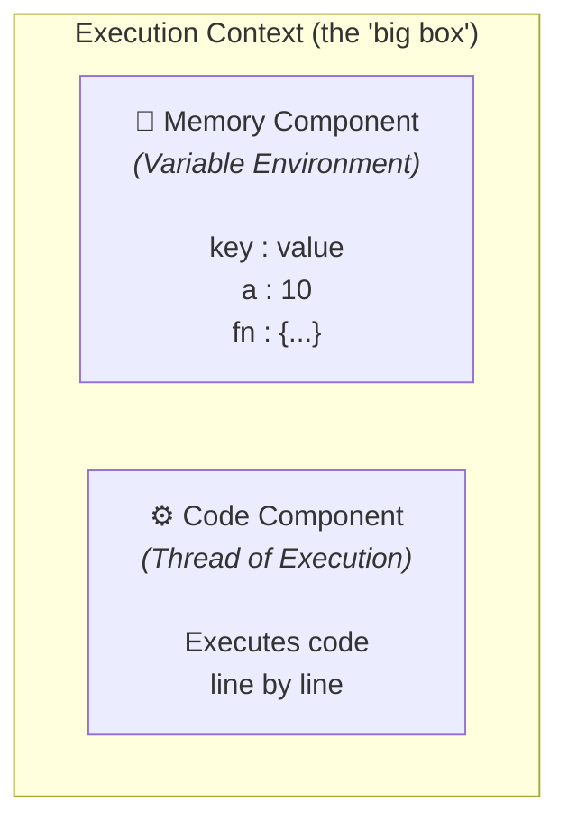
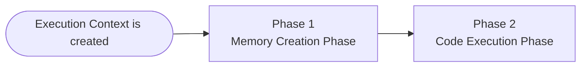
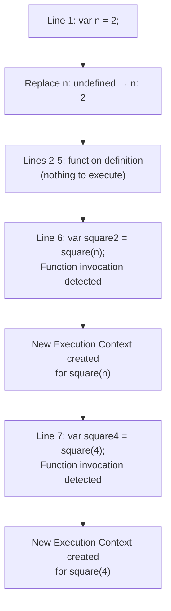
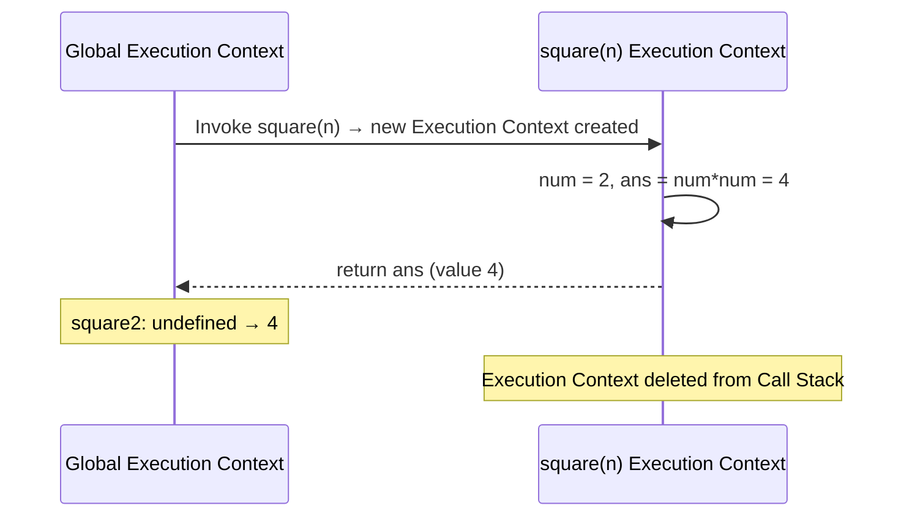
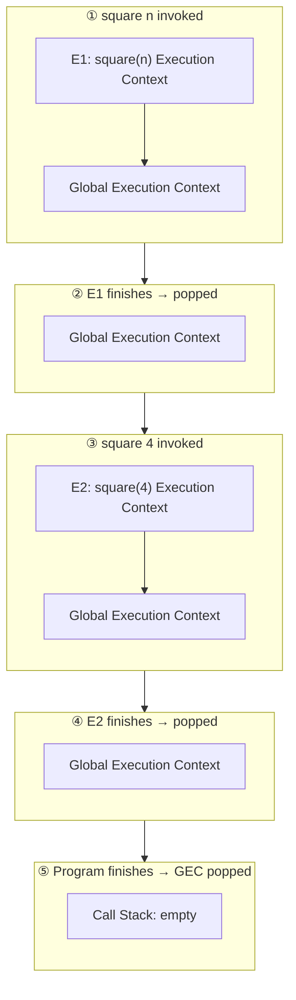
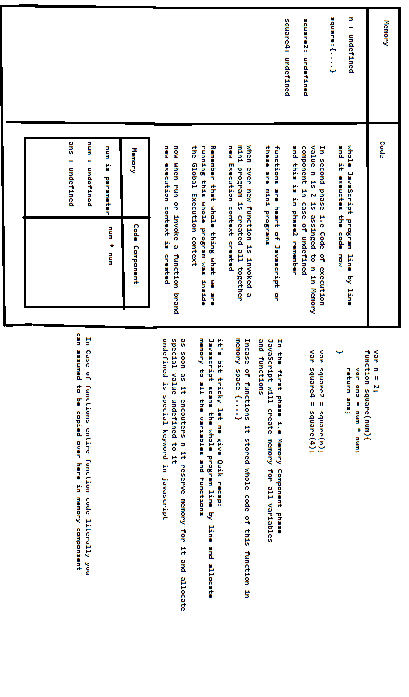

# JavaScript Execution Context — Complete Guide

> A structured walkthrough of how JavaScript creates and manages Execution Contexts, the Call Stack, and the two-phase execution model (Memory Creation Phase + Code Execution Phase).

---

## 1. What Is an Execution Context?

Everything in JavaScript happens inside an **Execution Context**.

Think of an Execution Context as a **big box (container)** in which the entire JavaScript program runs. Before a single line of your code executes, JavaScript creates a **Global Execution Context (GEC)** and places it on the **Call Stack**.

Every Execution Context is made up of **two components**:

| Component | Also Known As | What It Stores |
|---|---|---|
| **Memory Component** | Variable Environment | All variables and functions as `key : value` pairs |
| **Code Component** | Thread of Execution | Executes the code, one line at a time |



---

## 2. JavaScript Is Synchronous & Single-Threaded

- **Single-threaded** → JavaScript can execute only **one line of code at a time**.
- **Synchronous** → Each command runs **in a specific order**; JavaScript moves to the next line only after the current line finishes executing.

Together, this is why JavaScript is described as a **synchronous, single-threaded language**.

---

## 3. Example Program

All the concepts below are explained using this example:

```javascript
var n = 2;

function square(num) {
    var ans = num * num;
    return ans;
}

var square2 = square(n);
var square4 = square(4);
```

---

## 4. How an Execution Context Is Created — Two Phases

Every Execution Context (global **or** function-level) is created in **two phases**:



---

## 5. Global Execution Context — Phase 1: Memory Creation Phase

JavaScript scans the **entire program line by line** and allocates memory for **every variable and function**, *before* running any actual logic.

**Rules for this phase:**
- Variables → memory is allocated and initialized with the special placeholder value **`undefined`**.
- Functions → the **entire function code is copied as-is** into the memory component.

Walking through the example line by line:

| Step | Line Encountered | Action | Memory State |
|---|---|---|---|
| 1 | `var n = 2;` | Allocate memory for `n` | `n: undefined` |
| 2 | `function square(num){...}` | Allocate memory for `square`, copy the **entire function** into memory | `square: fn {...}` |
| 3 | `var square2 = square(n);` | Allocate memory for `square2` | `square2: undefined` |
| 4 | `var square4 = square(4);` | Allocate memory for `square4` | `square4: undefined` |

**Global Memory Component after Phase 1:**

```
n        : undefined
square   : fn {...}
square2  : undefined
square4  : undefined
```

---

## 6. Global Execution Context — Phase 2: Code Execution Phase

JavaScript now runs through the program **again, line by line**, this time actually **executing** the code.



- **Line 1:** `n`'s value is updated from `undefined` → `2`.
- **Lines 2–5:** Nothing executes — this is just the function *definition*.
- **Line 6:** JavaScript sees `square(n)` — parentheses `()` after a function name mean the function is being **invoked (called)**.

> **Key idea:** Functions are the heart of JavaScript. When a function is invoked, it behaves like a **mini-program**, and a **brand-new Execution Context** is created for it — inside the Code Component of the Global Execution Context.

---

## 7. Function Invocation Creates a New Execution Context

> ⚠️ **Important:** Everything discussed so far was happening inside the **Global Execution Context**. The moment a function is *called*, a **separate, brand-new Execution Context** is created just for that function.

This new Execution Context also has its own **Memory Component** and **Code Component**, and goes through the **same two phases**.

### 7.1 Phase 1: Memory Creation (for `square(n)`)

Only the code relevant to this function call is considered:

```javascript
function square(num){
    var ans = num * num;
    return ans;
}
```

Memory is allocated for the **parameter** (`num`) and the local **variable** (`ans`) — both initialized to `undefined`:

```
num : undefined
ans : undefined
```

### 7.2 Phase 2: Code Execution (for `square(n)`)

| Step | What Happens | Memory Update |
|---|---|---|
| 1 | The value of `n` (which is `2`) is passed into `num`. `num` is the **parameter**, `n` is the **argument**. | `num: undefined → 2` |
| 2 | `num * num` is calculated → `2 * 2 = 4` | `ans: undefined → 4` |
| 3 | `return ans;` is encountered | Control returns to the caller with value `4` |

### 7.3 The `return` Keyword & Control Flow

The `return` keyword tells the function: *"you're done — hand control back to wherever this function was invoked."*



So, back in the Global Execution Context:

```
square2 : undefined → 4
```

Once the function finishes execution, its **Execution Context is removed (popped) from the Call Stack**.

---

## 8. Second Function Call: `square(4)`

Line 7, `var square4 = square(4);`, triggers the **exact same process** — only the argument changes.

1. A **new** Execution Context is created (separate from the one used for `square(n)`, which has already been deleted).
2. **Phase 1 (Memory Creation):** `num: undefined`, `ans: undefined`
3. **Phase 2 (Code Execution):** `num = 4` → `ans = 4 * 4 = 16` → `return ans;`
4. Control returns to the Global Execution Context: `square4: undefined → 16`
5. This function's Execution Context is also deleted from the Call Stack.

---

## 9. The Call Stack

### 9.1 Why Do We Need a Call Stack?

Managing all this creation and deletion of Execution Contexts is a lot for the JavaScript engine to handle — especially when there are **multiple function calls**, possibly nested many levels deep. JavaScript needs a reliable, systematic way to track:

- Which Execution Context is currently running
- Where to return control once an Execution Context finishes

This is exactly what the **Call Stack** manages — the creation, execution, and deletion of every Execution Context, in the correct order.

### 9.2 What Is the Call Stack?

The Call Stack behaves exactly like a **Stack data structure** — **LIFO (Last In, First Out)**.

- The **Global Execution Context (GEC)** always sits at the **bottom** of the stack — it's pushed the moment any JavaScript program starts running.
- Every time a function is **invoked**, a new Execution Context is created and **pushed** on top of the stack.
- Once that Execution Context **finishes running**, it is **popped off** the stack, and control returns to whoever called it.
- Once the **entire program finishes**, the GEC itself is popped off, and the Call Stack becomes **empty**.

Let's label the Execution Context created for `square(n)` as **E1**, and the one created for `square(4)` as **E2**:



Step by step:

1. `square(n)` is invoked → **E1** is pushed on top of the GEC.
2. E1 finishes executing (hits `return`) → it's **popped off**, and control returns to the line `var square2 = square(n);`.
3. Execution moves to the next line → `square(4)` is invoked → **E2** is pushed on top of the GEC.
4. E2 finishes executing → it's **popped off**, control returns to the caller.
5. The entire program finishes running → the **GEC itself is popped off** → Call Stack is **empty**.

> 📌 **Key Rule:** The Call Stack maintains the *order of execution* of Execution Contexts.

### 9.3 Other Names for the Call Stack

You'll see the Call Stack referred to by several different names across books, docs, and talks — they all mean the same thing:

| Alternate Name |
|---|
| Call Stack |
| Execution Context Stack |
| Program Stack |
| Control Stack |
| Runtime Stack |
| Machine Stack |

---

## 10. Final Global Memory State

After both function calls complete, the Global Execution Context's memory looks like this:

```
n        : 2
square   : fn {...}
square2  : 4
square4  : 16
```

---

## 11. Key Takeaways

- Every JS program runs inside an **Execution Context** — think of it as a container with a **Memory Component** and a **Code Component**.
- Execution Contexts are built in **two phases**: **Memory Creation** (allocate, initialize as `undefined`, copy function code) → **Code Execution** (run line by line, assign real values).
- JavaScript is **synchronous** and **single-threaded** — one line, in order, at a time.
- Every **function invocation** (`functionName()`) creates a **brand-new Execution Context**, pushed onto the **Call Stack**.
- The **`return`** keyword sends control (and a value) back to wherever the function was called from.
- Once a function finishes, its Execution Context is **popped off the Call Stack** and deleted.
- The **Call Stack** (LIFO) is what the JS engine uses to track and manage the creation/deletion of every Execution Context, in order — with the **GEC always at the bottom**, and it too is popped once the whole program finishes.
- The Call Stack is also known as the **Execution Context Stack, Program Stack, Control Stack, Runtime Stack,** or **Machine Stack**.

---

## Reference Diagrams (Original Hand-Drawn Notes)

The flow above was digitized from the following original diagrams:




